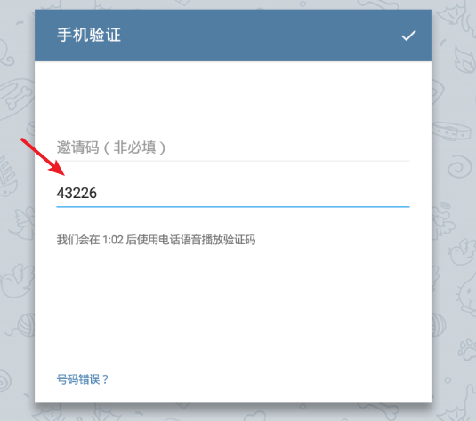
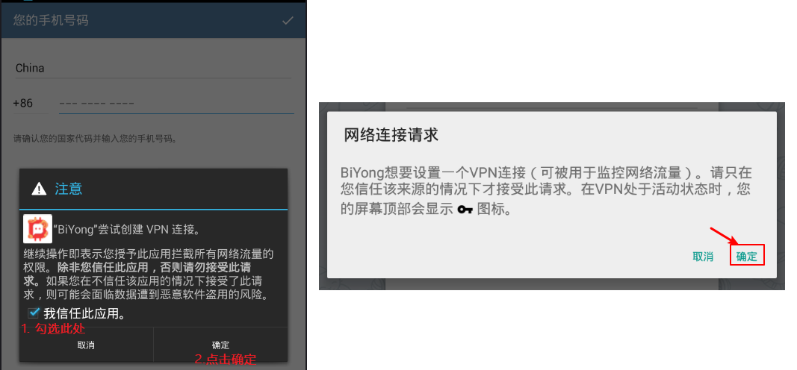
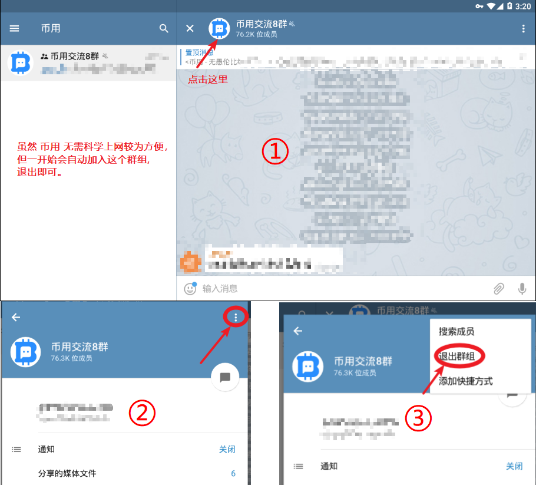
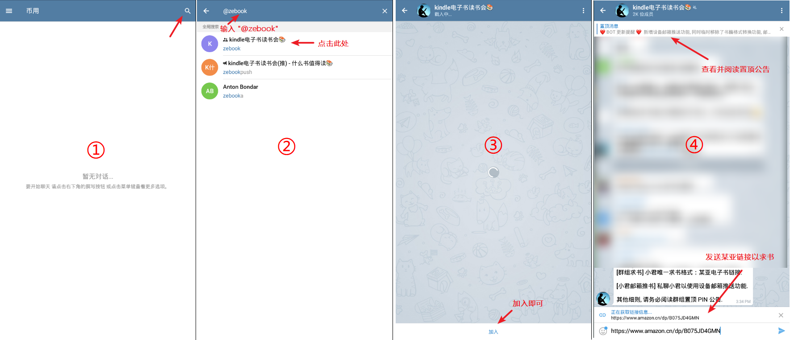
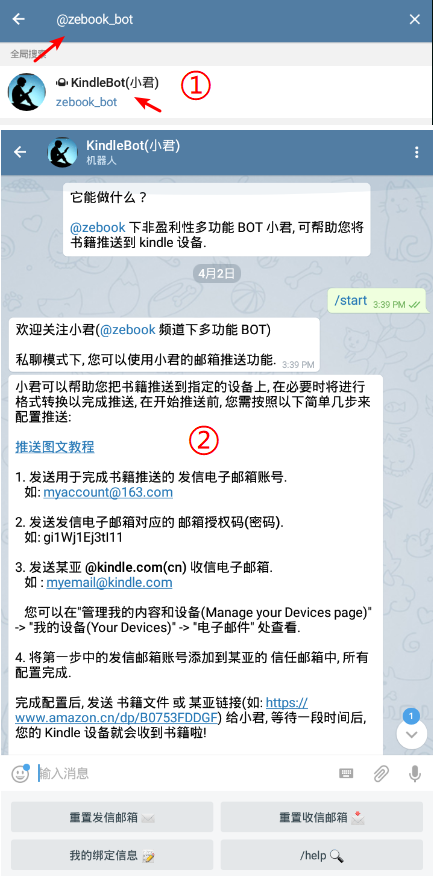

# @ZEbook--优质且免费的电子书小圈

现如今，各种电子书资源站如雨后春笋般涌现，它们无一例外，均以盈利性为目的、以各种理由来圈钱，想方设法吸引大家开会员、充值金币等。而诸如充值后就被封号、资源质量低劣被骗等等其他各种问题，也正不断涌现。

@ZEbook，愿以开放, 包容的互联网开源精神，以 Telegram 为平台做一次尝试，打造一个提供优质资源、分享知识的小圈，在尽量不影响出版行业发展的同时，试着打破些许的知识壁垒。

经过一段时间的考量，小圈的主要技术人员根据需求编码出了小君(BOT)。我们基于购买和收录的互联网资源，经由人工和小君的**双重核验**，筛选出**最优资源**，由勤勤恳恳，能 24 小时不间断工作的小君，**实时**提供给小圈内的书友们，以供阅读。

我们希望能为您**省下比对资源优劣之时间，免去杂乱网站被骗之风险，拆去知识昂贵代价之壁垒**，回归读书的初心，在小圈内找到志同道合之人，一同分享你的想法。

## @ZEbook 能提供什么?

- **最为优质**且齐全的电子书资源
- **便捷**的书籍邮箱推送服务
- **实时**的请求响应
- 志同道合者的交流小圈
- ……

## 如何加入小圈?——仅需三步
1. 使用 Telegram 平台

   - **Why Telegram？**

     [微信之外最优选！纯净安全的聊天工具 – Telegram ](https://www.ifanr.com/app/485421)

     [微信之外,有人选择了 Telegram | 爱范儿](http://www.ifanr.com/504427)

     Telegram 支持全平台，它纯净和自由之理念，让我们最终选择了它。

     ​

   - 使用 Telegram 几种可选方式

     - **[推荐]**  [TelegramX](https://telegram.org/blog/telegram-x)

       界面酷炫，有一定使用门槛，大部分情况下**仅需登陆时科学上网**。

       [X for Android](https://play.google.com/store/apps/details?id=org.thunderdog.challegram&hl=en)

       [X for iOS](https://itunes.apple.com/us/app/telegram-x/id898228810?mt=8)

     - **[推荐]** [Telegram 第三方客户端"币用"](https://www.biyong.io)

       针对国内用户优化，汉化界面，大部分情况下**可直接使用**(自带科学上网功能)。

       （如果无法登陆，则也需科学上网）

     - Telegram [官方原版](https://telegram.org/apps)

       有一定使用门槛，**需全程科学上网**。

     - Telegram Web [官方网页版](https://web.telegram.org/#/im)
     - 
       有一定使用门槛，**需全程科学上网**。

   ​

2. 注册/登陆 Telegram
   输入手机号，并填入验证码以登陆
   

   如果使用  **币用** 第三方客户端，需有如下操作：
   
   
   ​

3. 加入 @ZEbook 小圈

   **群组求书**以及**邮箱推送功能**的使用：

   
   

至此，你已经完成了所有的操作并成功加入了我们的小圈，尽享阅读吧！

另：

欢迎再编辑、分享本文给周围有需要的书友们，邀请大家一同使用优质的服务。

同时，小圈的维护势必需要设备成本和人工成本，是一笔不小的开销。小圈提供的所有服务虽精，但都为免费，故如果加入小圈后您觉得不错，还请不吝赞赏，感谢支持！
